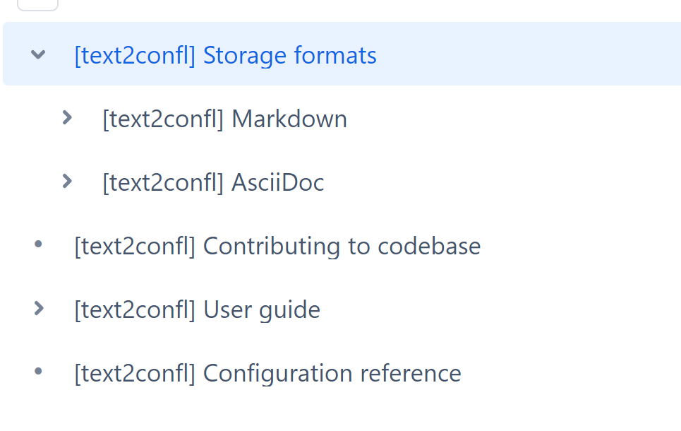

## Disclaimer

This is a fork of original [Text2Confl](https://github.com/zeldigas/text2confl)

It's main purposes is to deploy artifacts to maven central.

# text2confl

 

[](https://search.maven.org/artifact/io.github.text2confl/text2confl-cli) 

Is a tool for publishing documentation written in structured text formats like markdown to Confluence (either server or
cloud edition).

## Scope

`text2confl` does not care or assume the purpose of publishing process and the type of content you are going to upload -
it can be some formal docs managed as a code or todo list or some report of tickets from jira. Due to this fact there is
no clear end state of features (so far) that should be supported and features that should not be in this tool. If you
find something missing - feel free to create an issue and describe your needs.

## User guide

### CLI

To get started and learn how to start using text2confl, consult with [user guide](docs/user-guide.md).

If you want to quickly check how `text2confl` works you can upload documentation of text2confl itself. For this you need
to have your personal (or your company) Confluence server or account in Confluence cloud. Find a space where you want
docs to be published and parent page where docs will be created under:

```shell
# if you are in root of checked out text2confl repo
text2confl upload --docs ./docs \
  --confluence-url https://wiki.example.org \
  --user bob \
  --password secret_password \
  --space DOCS \
  --parent "Text2Confl test"
```

Will upload docs producing pages similar to this one:


**Note on having public showcase for docs**: I would be happy to use confluence cloud for this, but free tier does not
allow making space or pages available to non-members of wiki (wide open to internet) that's why so far you need to
publish to your own server or spend 10-15 minutes and create your own free wiki in Confluence Cloud.

### Maven

```xml
<dependency>
    <groupId>io.github.text2confl</groupId>
    <artifactId>text2confl-core</artifactId>
    <version>0.16.2</version>
</dependency>
```

Then 

## Design and usability goals

Here are a number of key principles that tool tries to follow:

1. Provide good features coverage for every supported source format - if you pick asciidoc you should feel comfortable
   by using its features and not always bumping into the fact that something is not supported.

   The important note here is that feature should somehow be mapped to Confluence feature or formatting capabilities.
2. Provide reasonable defaults and auto-detection of parameters where possible - if you use Confluence Cloud there is no
   need to specify editor version unless you have some non-standard needs.
3. Support both Confluence Server and Cloud and be aware of their differences in editors or features
4. If source format supports extensibility and customization - support it. There should be no need to create a fork just
   because you need to add some macros for your asciidoc documents.

## Supported source formats

By design multiple formats can be supported and even mixed together thus given you the option to mix and match one type
of documents like markdown with another type of documents like asciidoc and be able to select what to use for every
page.

Here are the state of support of formats:

1. ✅ Markdown - supported
2. ✅ Asciidoc - supported


